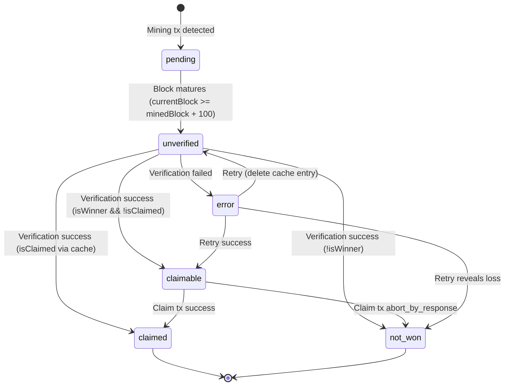
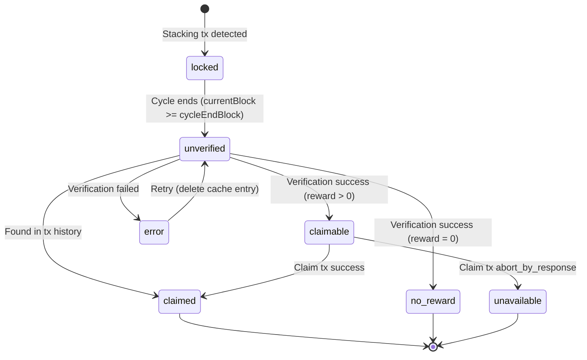

# Claim State Machine Documentation

This document describes how mining and stacking entries transition through various states in the CityCoins claims system. Understanding these state machines is essential for debugging claim issues and maintaining the codebase.

## Overview

The claims system tracks two types of entries:
1. **Mining Entries** - Records of blocks mined by the user
2. **Stacking Entries** - Records of cycles where user stacked tokens

Each entry type has its own state machine with distinct states and transitions. State is computed from three sources with a strict priority order.

## State Priority Rules

State is determined by the following priority (highest to lowest):

1. **Transaction History** - If a claim transaction exists (success or failure)
2. **Verification Cache** - If the entry has been manually verified
3. **Base Status** - Computed from current block height vs. entry timing

This priority is enforced in:
- `verifiedMiningEntriesAtom` (src/store/claims.ts:415-441)
- `verifiedStackingEntriesAtom` (src/store/claims.ts:494-520)

```
Priority 1: Transaction History (claimed/not-won from claim tx)
     |
     v
Priority 2: Verification Cache (from manual verification)
     |
     v
Priority 3: Base Status (pending/unverified from timing)
```

---

## Mining State Machine

### States

| State | Description | Color (UI) |
|-------|-------------|------------|
| `pending` | Block not yet matured (<100 blocks) | yellow |
| `unverified` | Matured, needs on-chain verification | orange |
| `claimable` | Verified winner, can claim reward | green |
| `claimed` | Already claimed (from tx history) | gray |
| `not-won` | Lost lottery or failed claim | red |
| `error` | Verification failed | red |

Type definition: `src/store/claims.ts:53-59`

### State Diagram (Mermaid)



### ASCII State Diagram

```
                        +------------------+
                        |   Mining TX      |
                        |   Detected       |
                        +--------+---------+
                                 |
                                 v
                        +--------+---------+
                        |    PENDING       |
                        | (< 100 blocks)   |
                        +--------+---------+
                                 |
                                 | currentBlock >= minedBlock + 100
                                 v
                        +--------+---------+
                        |   UNVERIFIED     |
                        | (needs check)    |
                        +--------+---------+
                                 |
            +--------------------+--------------------+
            |                    |                    |
            v                    v                    v
    +-------+-------+    +-------+-------+    +-------+-------+
    |   CLAIMABLE   |    |    NOT-WON    |    |     ERROR     |
    | (won lottery) |    | (lost lottery)|    | (check failed)|
    +-------+-------+    +---------------+    +-------+-------+
            |                                         |
            |                                         | retry
            v                                         |
    +-------+-------+                                 |
    |    CLAIMED    |<--------------------------------+
    | (tx success)  |         (if retry succeeds)
    +---------------+
```

### Transition Triggers

#### 1. Initial State: `pending`
**Location:** `processedTransactionsAtom` (src/store/claims.ts:227-239)

```typescript
// Entry created from mining transaction
status: isMiningClaimEligible(block, currentBlock) ? "unverified" : "pending"
```

**Trigger:** Mining transaction (`mine-tokens`, `mine-many`, `mine`) detected in transaction history with `tx_status === "success"`.

#### 2. `pending` -> `unverified`
**Location:** Re-computation in `processedTransactionsAtom` when `blockHeightsAtom` updates.

**Condition:** `currentBlock >= minedBlock + MINING_CLAIM_MATURITY` (100 blocks)
- Defined in: `isMiningClaimEligible()` (src/config/city-config.ts:609-611)

**Trigger:** Block height refresh (`fetchBlockHeightsAtom`)

#### 3. `unverified` -> `claimable` | `not-won` | `claimed`
**Location:** `verifySingleMiningAtom` (src/store/verification.ts:196-284)

**Trigger:** User clicks "Verify" button in UI -> `verifySingleMining(entry)`

**Logic:** (src/store/verification.ts:235-247)
```typescript
if (isClaimed) {
  status = "claimed";
} else if (canClaim) {
  status = "claimable";
} else if (!isWinner) {
  status = "not-won";
} else {
  status = "not-won"; // Winner but can't claim = already claimed
}
```

**API Call Flow:**
1. `verifyMiningClaim()` (src/utilities/claim-verification.ts:55-152)
2. Routes to legacy or protocol API based on version
3. Returns `{ isWinner, isClaimed, canClaim }`

#### 4. `claimable` -> `claimed`
**Location:** UI callback in `mia.tsx:131-142` / `nyc.tsx`

**Trigger:** User clicks "Claim" button -> `handleMiningClaim(entry)`

**Flow:**
1. `buildMiningClaimTx()` (src/utilities/claim-transactions.ts:28-55)
2. `executeClaimTransaction()` via `@stacks/connect`
3. Transaction broadcast
4. On next tx fetch, claim tx detected -> `claimedMiningBlocks` Map updated
5. `miningEntriesAtom` merges status from tx history (src/store/claims.ts:322-339)

#### 5. `claimable` -> `not-won`
**Condition:** Claim transaction fails with `tx_status === "abort_by_response"`

**Location:** `processedTransactionsAtom` line 256 tracks failed claims in `failedMiningBlocks` Map.

#### 6. `error` -> retry
**Location:** `retryFailedMiningAtom` (src/store/verification.ts:633-668)

**Trigger:** User clicks "Retry Failed" button

**Flow:**
1. Delete error entries from verification cache
2. Call `verifyAllMiningAtom` with failed entries

---

## Stacking State Machine

### States

| State | Description | Color (UI) |
|-------|-------------|------------|
| `locked` | Stacking cycle not yet complete | blue |
| `unverified` | Cycle complete, needs verification | orange |
| `claimable` | Verified reward available | green |
| `claimed` | Already claimed | gray |
| `no-reward` | Verified no reward for cycle | orange |
| `unavailable` | Failed claim attempt | red |

Type definition: `src/store/claims.ts:67-73`

### State Diagram (Mermaid)



### ASCII State Diagram

```
                        +------------------+
                        |  Stacking TX     |
                        |   Detected       |
                        +--------+---------+
                                 |
                                 v
                        +--------+---------+
                        |     LOCKED       |
                        | (cycle active)   |
                        +--------+---------+
                                 |
                                 | currentBlock >= cycleEndBlock
                                 v
                        +--------+---------+
                        |   UNVERIFIED     |
                        | (needs check)    |
                        +--------+---------+
                                 |
            +--------------------+--------------------+
            |                    |                    |
            v                    v                    v
    +-------+-------+    +-------+-------+    +-------+-------+
    |   CLAIMABLE   |    |   NO-REWARD   |    | UNAVAILABLE   |
    | (reward > 0)  |    | (reward = 0)  |    | (error/fail)  |
    +-------+-------+    +---------------+    +---------------+
            |
            |
            v
    +-------+-------+
    |    CLAIMED    |
    | (tx success)  |
    +---------------+
```

### Transition Triggers

#### 1. Initial State: `locked`
**Location:** `processedTransactionsAtom` (src/store/claims.ts:274-290)

```typescript
// Entry created from stacking transaction
status: isStackingClaimEligible(city, version, cycle, currentBlock)
  ? "unverified"
  : "locked"
```

**Trigger:** Stacking transaction (`stack-tokens`, `stack`) detected with `tx_status === "success"`.

**Note:** One stacking tx creates MULTIPLE entries (one per cycle based on `lockPeriod`).

#### 2. `locked` -> `unverified`
**Location:** Re-computation when `blockHeightsAtom` updates.

**Condition:** `currentBlock >= getCycleFirstBlock(city, version, cycle + 1)`
- Defined in: `isStackingClaimEligible()` (src/config/city-config.ts:617-625)

**Trigger:** Block height refresh

#### 3. `unverified` -> `claimable` | `no-reward`
**Location:** `verifySingleStackingAtom` (src/store/verification.ts:418-503)

**Trigger:** User clicks "Verify" button -> `verifySingleStacking(entry)`

**Prerequisite:** User must have a `userId` for the version being verified.
- User IDs fetched via `fetchUserIdsAtom` (src/store/stacks.ts:105-146)
- Stacking verification requires `userId`, not `stxAddress`

**Logic:** (src/store/verification.ts:464-471)
```typescript
const status: VerificationStatus = canClaim ? "claimable" : "no-reward";
```

**API Call Flow:**
1. `verifyStackingClaim()` (src/utilities/claim-verification.ts:171-226)
2. Routes to legacy or protocol API
3. Returns `{ reward, canClaim }` where `canClaim = reward > 0`

#### 4. `claimable` -> `claimed`
**Location:** UI callback in `mia.tsx:144-155` / `nyc.tsx`

**Trigger:** User clicks "Claim" -> `handleStackingClaim(entry)`

**Flow:**
1. `buildStackingClaimTx()` (src/utilities/claim-transactions.ts:63-92)
2. `executeClaimTransaction()` via `@stacks/connect`
3. On next tx fetch, claim tx detected -> `claimedStackingCycles` Map updated
4. `stackingEntriesAtom` merges status (src/store/claims.ts:462-479)

#### 5. `claimable` -> `unavailable`
**Condition:** Claim transaction fails with `tx_status === "abort_by_response"`

**Location:** `processedTransactionsAtom` tracks in `failedStackingCycles` Map (line 309).

---

## Atom Ownership Map

### Entry Creation & Base Status

| Atom | File:Line | Responsibility |
|------|-----------|----------------|
| `transactionsAtom` | stacks.ts:166-201 | Raw transaction storage |
| `processedTransactionsAtom` | claims.ts:194-315 | Single-pass tx processing, entry creation |
| `miningEntriesAtom` | claims.ts:322-339 | Merge tx history (claimed/not-won) |
| `stackingEntriesAtom` | claims.ts:462-479 | Merge tx history (claimed/unavailable) |

### Verification Layer

| Atom | File:Line | Responsibility |
|------|-----------|----------------|
| `verificationCacheByAddressAtom` | verification.ts:113-115 | Persistent cache per address |
| `verificationCacheAtom` | verification.ts:121-137 | Current address cache view |
| `verifiedMiningEntriesAtom` | claims.ts:415-441 | Merge verification cache |
| `verifiedStackingEntriesAtom` | claims.ts:494-520 | Merge verification cache |

### Actions

| Atom | File:Line | Trigger |
|------|-----------|---------|
| `verifySingleMiningAtom` | verification.ts:196-284 | Verify button click |
| `verifyAllMiningAtom` | verification.ts:289-409 | Verify All button |
| `verifySingleStackingAtom` | verification.ts:418-503 | Verify button click |
| `verifyAllStackingAtom` | verification.ts:508-623 | Verify All button |
| `retryFailedMiningAtom` | verification.ts:633-668 | Retry Failed button |
| `retryFailedStackingAtom` | verification.ts:674-709 | Retry Failed button |

### City-Filtered Views

| Atom | File:Line | Returns |
|------|-----------|---------|
| `miaMiningEntriesAtom` | claims.ts:540-543 | MIA mining entries |
| `nycMiningEntriesAtom` | claims.ts:545-548 | NYC mining entries |
| `miaStackingEntriesAtom` | claims.ts:550-553 | MIA stacking entries |
| `nycStackingEntriesAtom` | claims.ts:555-558 | NYC stacking entries |

---

## Key Questions Answered

### What determines initial state for an entry?

**Mining:** `isMiningClaimEligible(block, currentBlock)` at entry creation time.
- Returns `true` (-> `unverified`) if `currentBlock >= minedBlock + 100`
- Returns `false` (-> `pending`) otherwise

**Stacking:** `isStackingClaimEligible(city, version, cycle, currentBlock)` at entry creation.
- Returns `true` (-> `unverified`) if `currentBlock >= cycleEndBlock`
- Returns `false` (-> `locked`) otherwise

**Location:** `processedTransactionsAtom` (claims.ts:237, 286-287)

### When does verification trigger?

Verification is **manual only**. User must:
1. Click "Verify" on individual entry, OR
2. Click "Verify All" to batch verify unverified entries

**No automatic verification** - this is by design to respect rate limits.

**Verification runs:** When user triggers action atom (`verifySingleMiningAtom`, etc.)

### How does claimed status get detected?

Two detection paths:

1. **Transaction History (Priority 1):**
   - `processedTransactionsAtom` scans for `claim-mining-reward` / `claim-stacking-reward` txs
   - Success txs populate `claimedMiningBlocks` / `claimedStackingCycles` Maps
   - `miningEntriesAtom` / `stackingEntriesAtom` merge this status

2. **Verification Cache (Priority 2):**
   - `verifyMiningClaim` API returns `isClaimed: true`
   - Status stored in `verificationCacheAtom`
   - `verifiedMiningEntriesAtom` maps this to status

Transaction history always wins if present (Priority 1).

---

## Cache Behavior

### Verification Cache

- **Storage:** `localStorage` via `atomWithStorage` under key `citycoins-verification-cache-v2`
- **Structure:** `{ [stxAddress]: { [entryKey]: VerificationResult } }`
- **Entry Key Format:** `{city}-{version}-{type}-{id}` (e.g., `mia-legacyV2-mining-58921`)
- **TTL:** None - cached indefinitely until manual clear
- **Clear:** Only via "Clear Data" button in app settings

### Staleness Scenarios

1. **Wallet switch:** Cache is keyed by address, so switching wallets shows different cache
2. **Claim without UI:** If user claims via another app, tx history will override cache
3. **Chain reorg:** Not handled - cache could show stale verification result
4. **Partial verification:** Some entries verified, some not - UI shows mixed states

---

## Data Flow Summary

```
Hiro API (transactions)
         |
         v
transactionsAtom (compressed localStorage)
         |
         v
processedTransactionsAtom (single-pass processing)
    |    |    |    |
    |    |    |    +-> claimedMiningBlocks Map
    |    |    +------> claimedStackingCycles Map
    |    +-----------> miningEntries (base status)
    +----------------> stackingEntries (base status)
         |
         v
miningEntriesAtom / stackingEntriesAtom
    (merge tx history -> claimed/not-won/unavailable)
         |
         v
verifiedMiningEntriesAtom / verifiedStackingEntriesAtom
    (merge verification cache -> claimable/no-reward/error)
         |
         v
City-filtered atoms (miaMiningEntriesAtom, etc.)
         |
         v
UI Components (PaginatedMiningTable, etc.)
```

---

## Related Documentation

- [Transaction Fetch Flow](./tx-fetch-flow.md) - How transactions are fetched and stored
- Phase 3 will document rate limiting bottlenecks
- Phase 4 will audit stale state scenarios
