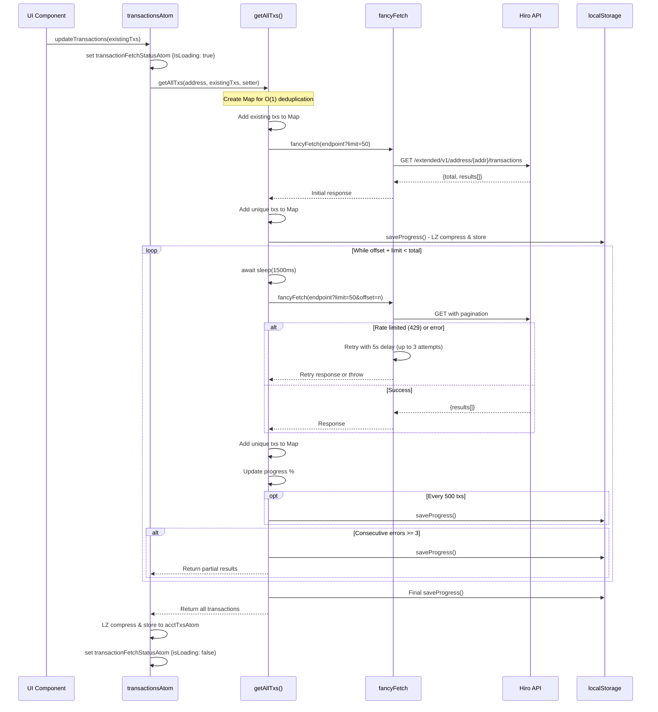

# Transaction Fetch Flow

> **Note:** Transaction fetching has been migrated from `fancyFetch` to `hiroFetch`. Some diagrams in this document still reference the old implementation. See PR #50 for migration details.

This document maps the complete data flow from Hiro API fetch through localStorage compression to Jotai atoms in the CityCoins UI v2 application.

## Overview

```
Hiro API (/extended/v1/address/{address}/transactions)
    |
    v
hiroFetch (rate-limit aware queue with Retry-After header support)
    |
    v
getAllTxs() - paginated fetch with deduplication
    |
    v
LZString.compress() - JSON string compression
    |
    v
acctTxsAtom (localStorage: "citycoins-stacks-acctTxs")
    |
    v
decompressedAcctTxsAtom (read-only, decompresses on access)
    |
    v
transactionsAtom (read/write wrapper)
    |
    +---> processedTransactionsAtom (single-pass decoding)
    |         |
    |         +---> miningEntriesAtom
    |         |         |
    |         |         v
    |         |    verifiedMiningEntriesAtom
    |         |         |
    |         |         +---> miaMiningEntriesAtom
    |         |         +---> nycMiningEntriesAtom
    |         |
    |         +---> stackingEntriesAtom
    |                   |
    |                   v
    |              verifiedStackingEntriesAtom
    |                   |
    |                   +---> miaStackingEntriesAtom
    |                   +---> nycStackingEntriesAtom
    |
    +---> minedBlocksAtom (Map<txId, blockNumbers[]>)
    +---> claimedBlocksAtom (Map<txId, blockNumbers[]>)
    +---> stackedCyclesAtom (Map<txId, cycleNumbers[]>)
    +---> claimedCyclesAtom (Map<txId, cycleNumbers[]>)
```

## Sequence Diagram



## Key Files Reference

| File | Line Range | Purpose |
|------|------------|---------|
| `src/store/stacks.ts` | 390-526 | `getAllTxs()` - Main pagination and deduplication logic |
| `src/store/stacks.ts` | 166-201 | `transactionsAtom` - Read/write atom for transactions |
| `src/store/stacks.ts` | 152-164 | `decompressedAcctTxsAtom` - LZ decompression |
| `src/store/stacks.ts` | 41-44 | `acctTxsAtom` - localStorage persistence |
| `src/store/common.ts` | 94-119 | `fancyFetch()` - Retry logic with fixed delays |
| `src/utilities/hiro-client.ts` | 226-285 | `hiroFetch()` - Header-aware rate limiting |

## Deduplication Algorithm

**Location:** `src/store/stacks.ts:403-409, 436-439, 473-477`

The deduplication uses a `Map<string, Transaction>` keyed by `tx_id` for O(1) lookup:

```typescript
// Initial setup (line 403-409)
const txMap = new Map<string, Transaction>();
for (const tx of existingTxs) {
  if (tx?.tx_id) txMap.set(tx.tx_id, tx);
}

// On each page fetch (line 436-439, 473-477)
for (const tx of newTransactions) {
  if (tx?.tx_id && !txMap.has(tx.tx_id)) {
    txMap.set(tx.tx_id, tx);
  }
}
```

**Characteristics:**
- Preserves first occurrence of each transaction
- O(1) time complexity for each deduplication check
- Memory efficient: only stores unique transactions
- Handles null/undefined tx_id gracefully

## Pagination Strategy

**Location:** `src/store/stacks.ts:396-398, 422-454, 457-512`

The fetch uses offset-based pagination with the Hiro v1 API:

```
Endpoint: /extended/v1/address/{address}/transactions
Parameters:
  - limit: 50 (fixed batch size)
  - offset: increments by 50 each iteration
```

**Flow:**

1. **Initial Request** (line 422-454):
   - Fetch first page with `?limit=50`
   - Extract `total` count from response
   - Early return if `existingCount === total` (no new transactions)
   - Early return if `results.length < limit` (all data fetched)

2. **Paginated Loop** (line 457-512):
   - Continue while `offset + limit < total`
   - Sleep 1500ms between requests (rate limiting)
   - Increment offset by limit after each successful fetch
   - Stop early if API returns fewer items than requested

**Gap/Duplicate Handling:**

| Scenario | Handling |
|----------|----------|
| New transactions during fetch | Included if encountered in pagination |
| Duplicate tx_id across pages | Deduplicated by Map (first occurrence kept) |
| API pagination gaps | Not detected; relies on API consistency |
| Reorgs during fetch | May cause inconsistencies; no rollback mechanism |

**Limitations:**
- No cursor-based pagination (would handle reorgs better)
- No gap detection between pages
- Offset pagination can miss/duplicate items if chain state changes during fetch

## Cache Triggers

### What Triggers a Refetch

**Location:** `src/components/layout/page-content.tsx:24-34`, `src/components/auth/sign-in.tsx:13-19`

1. **Initial Page Load** (page-content.tsx:24-34):
   ```typescript
   useEffect(() => {
     if (stxAddress && !fetchStatus.isLoading && !hasInitialized.current) {
       hasInitialized.current = true;
       updateTransactions(transactions); // Pass existing for incremental fetch
     }
   }, [stxAddress, fetchStatus.isLoading, transactions, updateTransactions]);
   ```
   - Triggers on mount when user is logged in
   - Uses `hasInitialized` ref to prevent duplicate fetches
   - Passes existing transactions to enable incremental updates

2. **Wallet Connect** (sign-in.tsx:13-19):
   ```typescript
   if (stxAddress) {
     await updateTransactions([]); // Fresh fetch, no existing transactions
   }
   ```
   - Triggers after successful wallet connection
   - Passes empty array (fresh fetch, not incremental)

### What Triggers a Cache Read

**Location:** `src/store/stacks.ts:166-172`

Cache read (no API call) occurs when:

1. `transactionsAtom` read accessor is called
2. Atom simply returns decompressed data from `acctTxsAtom`

```typescript
(get) => {
  const acctTxs = get(decompressedAcctTxsAtom);
  if (!acctTxs) return [];
  return acctTxs;
}
```

**Cache invalidation triggers:**
- None automatic; cache persists until:
  - User triggers refetch via wallet reconnect
  - User clears localStorage manually
  - `transactionsAtom` write is invoked with new data

## Rate Limiting Comparison

### fancyFetch (src/store/common.ts:94-119)

**Used by:** Transaction fetching in `getAllTxs()`

```typescript
async function fancyFetch<T>(url, json = true, retries = 3, attempts = 1): Promise<T> {
  try {
    const response = await fetch(url);
    if (!response.ok) throw new Error(...);
    return json ? await response.json() : await response.text();
  } catch (error) {
    if (attempts < retries) {
      await sleep(5000);  // Fixed 5 second delay
      return fancyFetch(url, json, retries, attempts + 1);
    }
    throw error;
  }
}
```

| Aspect | Value |
|--------|-------|
| Retry delay | Fixed 5000ms |
| Max retries | 3 (default) |
| Rate limit awareness | None |
| 429 handling | Treats as generic error |
| Header reading | None |

**Additional delay in getAllTxs:** 1500ms `sleep()` between paginated requests (line 458)

### hiroFetch (src/utilities/hiro-client.ts:226-285)

**Used by:** Contract read operations (verification, user ID lookups)

```typescript
async function hiroFetch<T>(url, options = {}): Promise<HiroClientResult<T>> {
  const { maxRetries = 3, ...fetchOptions } = options;

  for (let attempt = 0; attempt <= maxRetries; attempt++) {
    await hiroQueue.waitForTurn();  // Queue-based rate limiting

    const response = await fetch(url, fetchOptions);
    updateRateLimitState(response.headers);  // Track rate limit headers

    if (response.status === 429) {
      const retryAfter = parseRetryAfter(response.headers.get("Retry-After"));
      const waitMs = retryAfter || 1000 * Math.pow(2, attempt + 1);
      await sleep(waitMs);
      continue;
    }
    // ... handle response
  }
}
```

| Aspect | Value |
|--------|-------|
| Retry delay | Exponential backoff: 2s, 4s, 8s... |
| Max retries | 3 (default) |
| Rate limit awareness | Yes - reads headers |
| 429 handling | Respects `Retry-After` header |
| Header reading | `x-ratelimit-remaining-stacks-second/minute`, `ratelimit-reset`, `x-ratelimit-cost-stacks` |

**Queue-based throttling** (src/utilities/hiro-client.ts:109-160):
- Global request queue with calculated delays
- Default delay: 200ms when no header data
- Min delay: 50ms when quota available
- Slow delay: 500ms+ when per-minute quota < 10
- Max delay cap: 2000ms

## Data Compression

**Location:** `src/store/stacks.ts:189, 417`

Uses [lz-string](https://github.com/pieroxy/lz-string) for localStorage compression:

```typescript
// Compress on write (line 189, 417)
const compressedTxs = LZString.compress(JSON.stringify(newTxs));
set(acctTxsAtom, compressedTxs);

// Decompress on read (line 155-159)
const decompressedTxs: Transaction[] = JSON.parse(
  LZString.decompress(acctTxs)
);
```

**Benefits:**
- Reduces localStorage usage (5MB limit in most browsers)
- Enables storing more transactions for large wallets
- Transparent compression/decompression via atoms

**Considerations:**
- CPU overhead on read/write
- Decompression happens on every atom read (not cached)
- Error handling wraps in try/catch, returns empty array on failure

## Error Handling

**Location:** `src/store/stacks.ts:498-512`

```typescript
try {
  const response = await fancyFetch(...);
  consecutiveErrors = 0;  // Reset on success
  // ... process response
} catch (fetchError) {
  consecutiveErrors++;
  saveProgress();  // Save what we have

  if (consecutiveErrors >= maxConsecutiveErrors) {
    return getTransactions();  // Return partial results
  }

  // Exponential backoff: 5s, 10s, 20s
  const backoffTime = 5000 * Math.pow(2, consecutiveErrors - 1);
  await sleep(backoffTime);
  offset -= limit;  // Retry same offset
}
```

**Behavior:**
- Progress saved after each error
- After 3 consecutive errors: return partial results
- Exponential backoff within retry loop
- Offset decremented to retry failed page

## Summary of Key Questions

### How does pagination handle gaps/duplicates?

**Duplicates:** Handled via `Map<tx_id, Transaction>` - only first occurrence kept.

**Gaps:** Not explicitly detected. The algorithm relies on:
1. `total` count from initial response
2. API returning consistent results during pagination
3. Stopping when `results.length < limit` or `offset >= total`

If the chain state changes during a long fetch, gaps or duplicates may occur without detection.

### What triggers a refetch vs cache read?

**Refetch triggers:**
1. Page mount when logged in (once per session via `hasInitialized` ref)
2. Wallet connection via sign-in button

**Cache read:** All other `transactionsAtom` reads return decompressed localStorage data.

### Where does deduplication happen?

**Primary:** `getAllTxs()` function (src/store/stacks.ts:403-409, 436-439, 473-477) using `Map<tx_id, Transaction>`.

**Note:** Deduplication happens during the fetch process, not at read time. Once stored, transactions are assumed unique.
